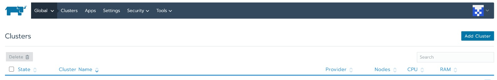
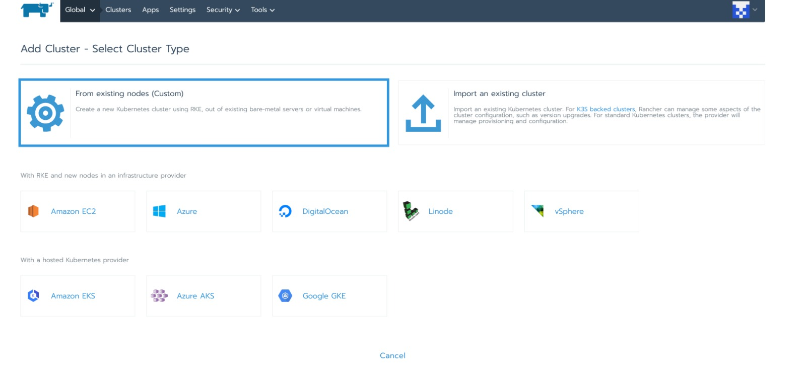
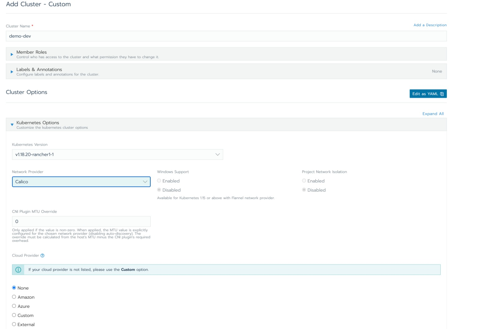
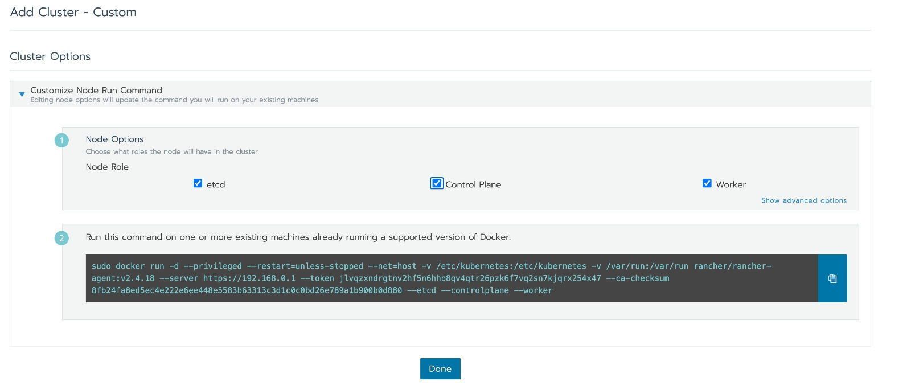
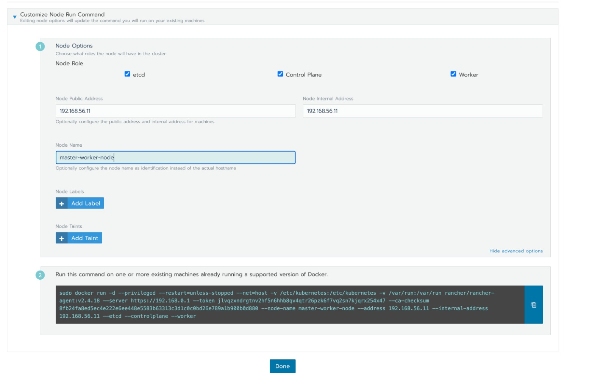
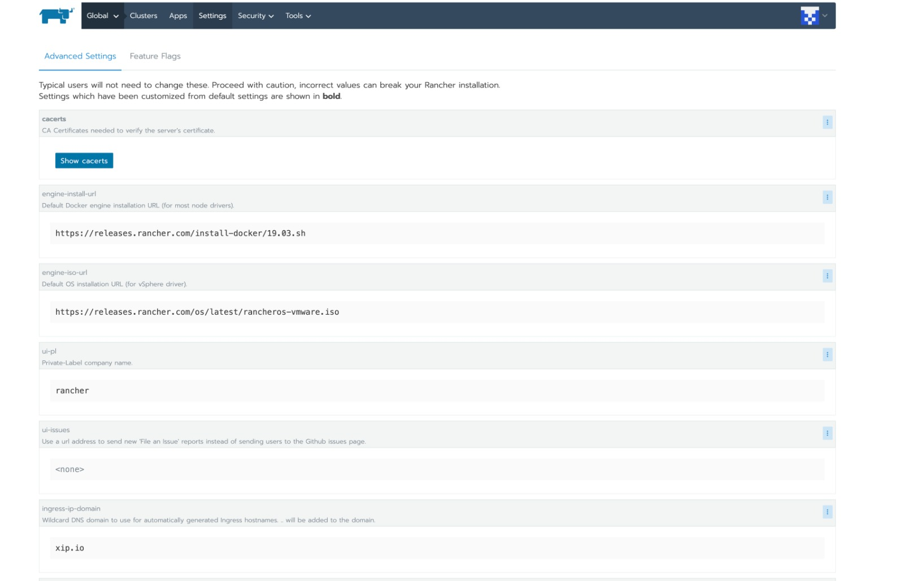
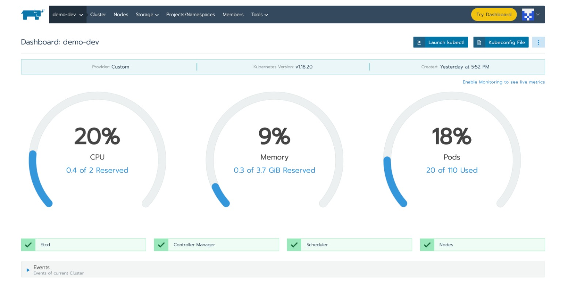
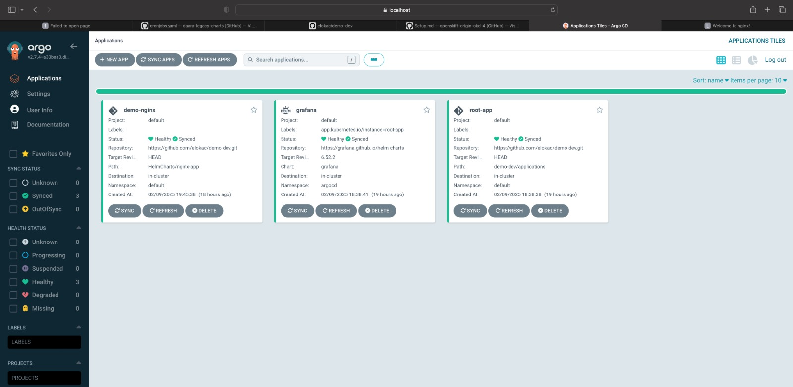

# Setting up a K3s Cluster with Rancher and Argo CD using Terraform

This document provides a step-by-step guide to setting up a K3s cluster on two Ubuntu 20.04 virtual machines using Vagrant and VirtualBox. It covers installing Rancher, deploying a K3s cluster using Rancher, optionally installing Argo CD with Terraform, and deploying applications using Argo CD.

## Table of Contents

1.  Prerequisites
2.  Infrastructure Setup with Vagrant
3.  Installing Rancher
4.  Deploying K3s Cluster using Rancher
5.  (Optional) Install Argo CD with Terraform
6.  Deploying Applications with Argo CD
7.  Bonus: Deploy a Custom Helm Chart
8.  Directory Structure
9.  Conclusion

## 1. Prerequisites

*   [VirtualBox](https://www.virtualbox.org/wiki/Downloads) installed
*   [Vagrant](https://www.vagrantup.com/downloads) installed
*   [Terraform](https://www.terraform.io/downloads) installed (for Argo CD installation)
*   [kubectl](https://kubernetes.io/docs/tasks/tools/) installed
*   A GitHub account

## 2. Infrastructure Setup with Vagrant

We'll use Vagrant to create two Ubuntu 20.04 virtual machines.

1.  **Create a project directory:**

    ```
    mkdir k3s-rancher-argocd
    cd k3s-rancher-argocd
    ```

2.  **Create a `Vagrantfile`:**

    Create a file named `Vagrantfile` in your project directory. This file defines the configuration for your virtual machines.

    ```
    Vagrant.configure("2") do |config|
        # ----- VM 1: Rancher Server -----
        config.vm.define "rancher-server" do |rancher|
            rancher.vm.box = "ubuntu/focal64"
            rancher.vm.box_version = "20240821.0.1"

            rancher.vm.network "private_network", ip: "192.168.56.10"
            rancher.vm.hostname = "rancher-server"

            # Port forwarding for Rancher UI
            rancher.vm.network "forwarded_port", guest: 80, host: 80, auto_correct: true
            rancher.vm.network "forwarded_port", guest: 443, host: 443, auto_correct: true

            rancher.vm.provider "virtualbox" do |vb|
                vb.memory = "4096"  # 4GB RAM
                vb.cpus = 2         # Adjust as needed 
                vb.name = "Rancher Server VM"
            end

            # Provisioning script for Rancher server (includes Docker)
            rancher.vm.provision "shell", inline: <<-SHELL
                echo "Running provisioning script for Rancher server..."

                # Update apt and install Docker
                sudo apt-get update
                sudo apt-get install -y docker.io
                sudo usermod -aG docker $USER
                newgrp docker
                sudo systemctl enable docker


                echo "docker installation complete."
            SHELL
        end

        # ----- VM 2: k3s Node -----
        config.vm.define "k3s-node" do |k3s|
            k3s.vm.box = "ubuntu/focal64"
            k3s.vm.box_version = "20240821.0.1"

            k3s.vm.network "private_network", ip: "192.168.56.11"
            k3s.vm.hostname = "k3s-node"

            k3s.vm.provider "virtualbox" do |vb|
                vb.memory = "4096" # 4GB RAM
                vb.cpus = 2        # Adjust as needed
                vb.name = "K3s Node VM"
            end

            # No provisioning script for K3s Node (DO NOT INSTALL DOCKER)
            k3s.vm.provision "shell", inline: <<-SHELL
                echo "Running provisioning script for K3s node..."
                echo "K3s node provisioning complete.  Docker is NOT installed."
            SHELL
        end
    end
    ```

    *   **`config.vm.box`**: Specifies the base image for the VMs.  You can find boxes on [Vagrant Cloud](https://app.vagrantup.com/).
    *   **`config.vm.network "private_network"`**: Configures a private network, allowing the VMs to communicate. Adjust the IP addresses as needed.
    *   **`config.vm.hostname`**: Sets the hostname of each VM.
    *   **`vb.memory` and `vb.cpus`**: Adjust the memory and CPU allocated to each VM based on your system resources. The settings above use 4GB of RAM, if you are having issues, reduce to 2048MB of RAM.
    *   **`config.vm.provision "shell"`**:  Installs Docker.

3.  **Start the VMs:**

    ```
    vagrant up
    ```

    This command will download the specified box images and create the virtual machines.

4.  **Verify the VMs are running:**

    ```
    vagrant status
    ```

    The output should show both "rancher-server" and "k3s-node" as "running".

## 3. Installing Rancher

1.  **SSH into the Rancher Server VM:**

    ```
    vagrant ssh rancher-server
    ```

2.  **Install Rancher:**

    Follow the official Rancher installation instructions, but run Rancher locally on the VM using Docker:

    ```
    docker run -d --name=rancher-server \
        --restart=unless-stopped -p 80:80 -p 443:443 \
        --privileged \
        rancher/rancher:v2.4.18
    ```

    *   **`--privileged`**:  Required for Rancher to manage Kubernetes clusters.
    *   `-p 80:80 -p 443:443`:  Maps ports 80 and 443 on the host to the container.
    *Note:* Rancher recommends at least 4 CPUs and 16 GB of memory but we can use 2CPUs and 4GB of memory for this.

3.  **Access Rancher UI:** Open a web browser and navigate to `https://192.168.56.10` (replace with the actual IP address of your `rancher-server` VM).  It may take several minutes for Rancher to fully initialize.

## 4. Deploying K3s Cluster using Rancher

1.  **Log in to Rancher UI:** Use the Rancher UI `https://192.168.56.10`.
2.  **Create Cluster:** Go to the Cluster Management view.
3.  Select "Add Cluster".
    
4.  Select "From the existing Node (custom)".
    
5.  Provide a cluster name (e.g., `demo-dev-cluster`) and put the network provider to `calicio` then leave every other thing to default and click next.
    
6.  Master and Node Pools:  select `etcd`, `control Plane` and ` worker` because we want the second VM to serve as a 1 node cluster. Then Select Advance setting. 
    
    In order case you can use 1 node as control plane, then you select only control plane and etcd. then adding worker node, you select Worker.
7.  Update Advance setting with private IP address of the Node you are adding. because we are using Virtualbox, without explicitly adding it, it will be difficult for Rancher server Node to connect to it.
    
8.  Copy the generated script and go to the VM you are adding to the cluster.
    Note: the script can only work when docker as been installed in that server and there is a unique docker versions that only work in a cluster.
    
    next step is to show you how to get the correct docker version
9. Click on Setting, then you would see `https://releases.rancher.com/install-docker/19.03.sh`. That's docker version.
   
   ssh to the terminal of the node you are adding to the cluster and run below command to install docker.
   `curl https://releases.rancher.com/install-docker/19.03.sh | sh`
   after this, you can run the command generated in step 8.

## 5. (Optional) Install Argo CD with Terraform

1.  **Create Terraform Files:** Create a directory named `terraform-script` and create the following files:

    *   `terraform-script/providers.tf`:

        ```
        terraform {
          required_providers {
            kubernetes = {
              source = "hashicorp/kubernetes"
              version = "2.32.0"
            }
          }
        }

        provider "kubernetes" {
            config_path    = "../kubeconfig"
            config_context = "demo-dev"
        }

        provider "helm" {
          kubernetes {
            config_path = "../kubeconfig"
          }
        }
        ```

        *   **Note:** The Kubernetes provider requires configuration to connect to your K3s cluster.  You'll need to retrieve the necessary credentials from your K3s cluster configuration. These are often found in the `kubeconfig.yaml` file. To get this, you can get from the Cluster you created in the Rancher UI.
        

    *   `terraform-script/namespace.tf`:
        ```
        resource "kubernetes_namespace" "argocd" {
          metadata {
            annotations = {
              name = "k3s-cluster"
            }

            labels = {
              managedby = "terraform"
            }

            name = "argocd"
          }
        }
        ```
    *   `terraform-script/argocd.tf`:

        ```
        resource "helm_release" "argocd" {
          name       = "argocd"
          namespace  = "argocd"
          chart      = "argocd"
          version    = "3.23.0"
          repository = "https://argoproj.github.io/argo-helm"
        }
        ```

2.  **Initialize Terraform:**

    ```
    cd terraform-script
    terraform init
    ```

3.  **Apply Terraform Configuration:**

    ```
    terraform apply --auto-approve
    ```

4.  **Access Argo CD UI:** Port forward to the Argo CD server:

    ```
    kubectl port-forward svc/argo-cd-argocd-server -n argocd 8080:443
    ```

5.  **Retrieve the initial admin password:**

    ```
    kubectl -n argocd get secret argocd-initial-admin-secret -o jsonpath="{.data.password}" | base64 --decode
    ```

6.  **Open a web browser and navigate to `https://localhost:8080`.** Use `admin` as the username and the decoded password.

## 6. Deploying Applications with Argo CD

1.  **Create GitHub Repository:** Create a GitHub repository with the following structure:

    ```
    └── demo-dev  # Cluster name
        ├── applications
        │   ├── app1.yaml
        │   └── app2.yaml
        └── root.yaml
    ```

2.  **Create Argo CD Application Manifest (e.g., `root.yaml`):**

    ```
    apiVersion: argoproj.io/v1alpha1
    kind: Application
    metadata:
      name: root-app
      finalizers:
      - resources-finalizer.argocd.argoproj.io
    spec:
      project: default
      source:
        repoURL: https://github.com/elokac/demo-dev.git
        path: demo-dev/applications
        targetRevision: HEAD
      destination:
        server: https://kubernetes.default.svc
        namespace: default
      syncPolicy:
        automated:
          selfHeal: true
          prune: true
    ```

3.  **Deploy the Initial App:**

    ```
    kubectl apply -n argocd -f <root.yaml path on github>
    ```

4.  **Connect the ArgoCD to the Github:** Connect the ArgoCD to the Github, by going to setting and Repository connection, then connect repo, and choose the right credentials for connecting ArgoCD to the repository.
5.  **Commit and Push:**
     Commit and push the changes to your GitHub repository.
     Argo CD will automatically detect the new Application resource and deploy the application. You may need to manually sync the application the first time.

## 7. Bonus: Deploy a Custom Helm Chart

1.  **Create a a new helm chart named `HelmCharts` in your repository.**
     `helm create HelmChart`

2.  update a file named values.yaml inside HelmCharts/nginx-app

    ```
    image:
      tag: latest
    service:
      type: NodePort
      port: 80
    ```

3.  Create a new Argo CD `Application` resource (e.g., `nginx-app.yaml`) to deploy your custom Helm chart.

    ```
    apiVersion: argoproj.io/v1alpha1
    kind: Application
    metadata:
      name: nginx-chart
      namespace: argocd
    spec:
      project: default
      source:
        repoURL: https://github.com/your-username/your-repo
        targetRevision: HEAD
        path: HelmCharts/nginx-app
      destination:
        server: https://kubernetes.default.svc
        namespace: default # deploy to the "default" namespace
      syncPolicy:
        automated:
          prune: true
          selfHeal: true
    ```

    If you wanted to create values_dev.yaml, you'd need to copy the file and create a resource on the Argo CD.
4.  Commit and push the changes to your Git repository.
5.  Argo CD will automatically detect the new `Application` and deploy your custom Helm chart.

You can log on to ArgoCD and see that the application is deployed.



## 8. Directory Structure
```
.
├── HelmCharts
│   └── nginx-app
│       ├── Chart.yaml
│       ├── charts
│       ├── templates
│       │   ├── NOTES.txt
│       │   ├── _helpers.tpl
│       │   ├── deployment.yaml
│       │   ├── hpa.yaml
│       │   ├── ingress.yaml
│       │   ├── service.yaml
│       │   ├── serviceaccount.yaml
│       │   └── tests
│       │       └── test-connection.yaml
│       ├── values.yaml
│       └── values_dev.yaml
├── Infrastructure-setup
│   ├── Cluster-5.png
│   ├── Cluster-8.png
│   ├── Vagrantfile
│   ├── cluster-1.jpeg
│   ├── cluster-2.png
│   ├── cluster-3.png
│   ├── cluster-4.png
│   ├── cluster-6.png
│   └── cluster-7.png
├── README.md
├── demo-dev
│   ├── applications
│   │   ├── app1.yaml
│   │   └── app2.yaml
│   └── root.yaml
└── terraform-script
    ├── argocd.tf
    ├── namespace.tf
    └── providers.tf
```